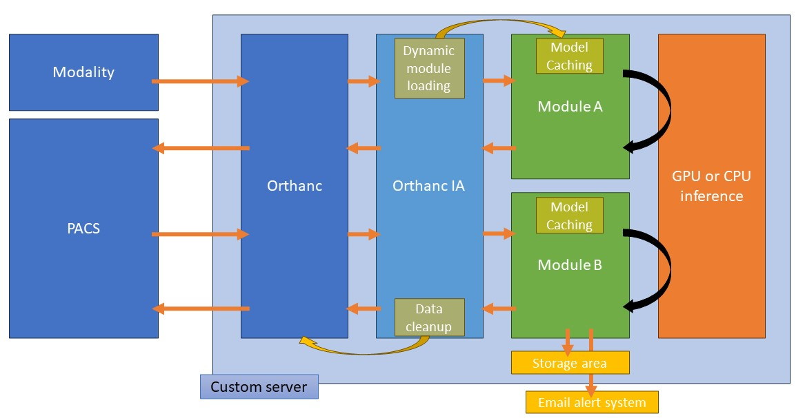

# OrthancAI

## What is OrthancAI ?

**OrthancAI** is a wraparound around [Orthanc](https://orthanc.uclouvain.be/) and [Orthanc Python plugin](https://orthanc.uclouvain.be/book/plugins/python.html), tailored for the deployment of fast and custom AI inference modules in a clinical workflow.

The advantages of **OrthancAI** are:

- Modular conception, allowing the deployment of multiple image post-treatment modules
- Possibility of preloading models in RAM (*Module Caching*), allowing fast GPU or CPU inference as soon as DICOM files are received
- Cleanup system, allowing a temporary storage of processed files, thus increasing safety and reducing storage requirements
- Dynamic module loading, allowing to hot-change modules parameters and code source without restarting Orthanc




## How to install OrthancAI

1. Install on your own server
   - Install a standard Linux distribution (such as Ubuntu)
   - Install Python (>=3.9)
     ```
     sudo apt update
     sudo apt install python3 python3-pip
     ```
   - Install Orthanc and its Python plugin
     ```
     sudo apt install orthanc orthanc-dev orthanc-python
     ```
   - Download OrthancAI latest release and copy files in **/etc/orthanc**
   - Install python requirements
     ```
     pip install -r requirements.txt
     ```
     
2. Install Docker image : *TODO*

## Configure Orthanc, Python plugin and Orthanc AI

### Configure Orthanc

To configure your Orthanc server, you can check official [Orthanc documentation](https://orthanc.uclouvain.be/book/users/configuration.html#configuration). We recommend you set the following parameters in the **/etc/orthanc/orthanc.json** file for optimal compatibility:

- Enable REST API which is necessary for OrthancAI to work :
```
"HttpServerEnabled" : true 
```

- Activate DICOM server for obvious reasons
```
"DicomServerEnabled" : true
```

- Enable multiple AET for multiple modules :
```
"DicomCheckCalledAet" : false
```

- Set the port of your choice for DICOM incoming requests:
```
"DicomPort" : 8042
```

- Under the **"DicomModality"** header, add your PACS destination.
```
"DestinationName" : {"AET" : "AET", "Host" : "123.456.789.0", "Port" : 1234 }
```

- Number of seconds for the series/study/patient considered as stable (I usually set it to 5 seconds)
```
"StableAge" : 5
```

### Configure Python plugin

In the **/etc/orthanc/python.json** file, set the following parameter:

```
"PythonScript" : "/etc/orthanc/orthanc_ai.py"
```

### Configure OrthancAI

Configuration of **/etc/orthanc/orthanc_ai.json** is pretty straightforward.

- *ModuleLoadingHeuristic* defines how the modules are named and searched (using wildcards)
- *AutoRemove* defines if files are deleted after being processed

### Configure OrthancAI modules

Each OrthancAI module, located in the *oai_modules* directory, has its own  mandatory parameters. Other parameters, optional to each module, can also be proposed. These are mandatory parameters: 

- *ClassName* : must correspond to the main class name defined in the module (oai_xxx.py)
- *TriggerLevel* : defines with what data the module is called. Can be **Patient**, **Study** or **Series**
- *CallingAET* : the AET name that will trigger module processing. A same AET can be used on several modules
- *DestinationName* : the destination name where the returned files will be pushed. Note that it is an *orthanc destination name* as defined in the orthanc configuration file, not the AET
- *Filters* and *NegativeFilters* are array containing filters allowing to decide if the processing will be performed or not. The filters are applied to each individual files. It should be given as a dictionary of lists. Dictionary keys can be any of the following DICOM tags :
```
AccessionNumber, PatientName, PatientID, StudyDescription, SeriesDescription, ImageType, InstitutionName, InstitutionalDepartmentName, Manufacturer, ManufacturerModelName, Modality, OperatorsName, PerformingPhysicianName, ProtocolName, StudyID
```
Each filter shall have the following structure:
```
  "Filters": {
    "PatientName": ["Test","Or*Another"],
    "SeriesDescription": ["Test"]
  },
```
For **Positive** filters, each key should match with one of the strings given (regular expressions allowed). For **Negative** filters, each key should NOT match with any of the strings given.
